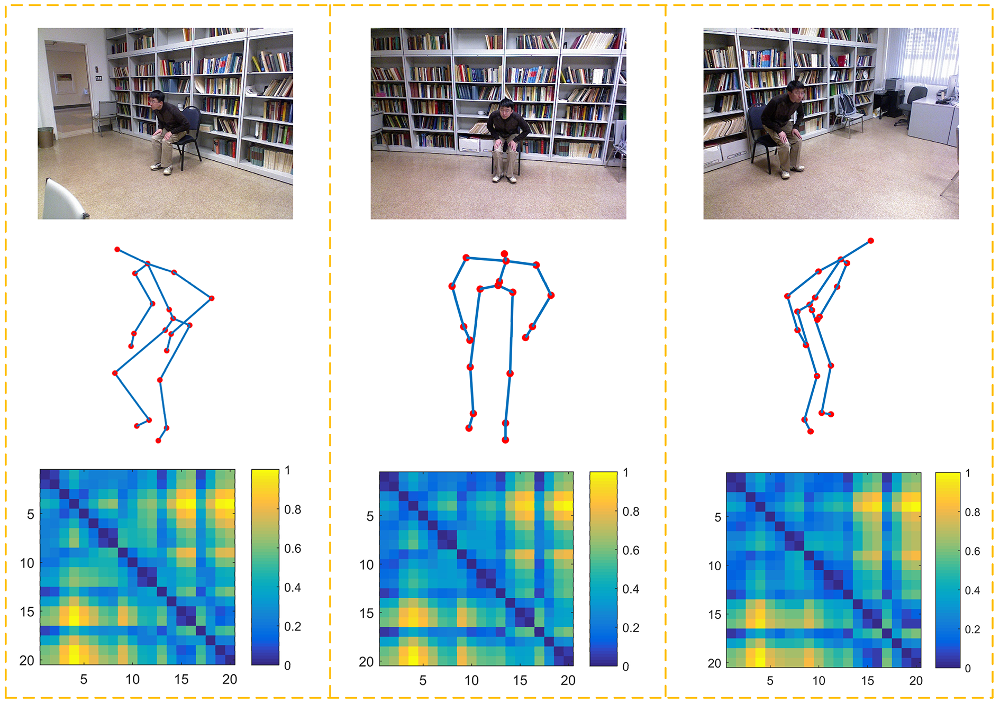
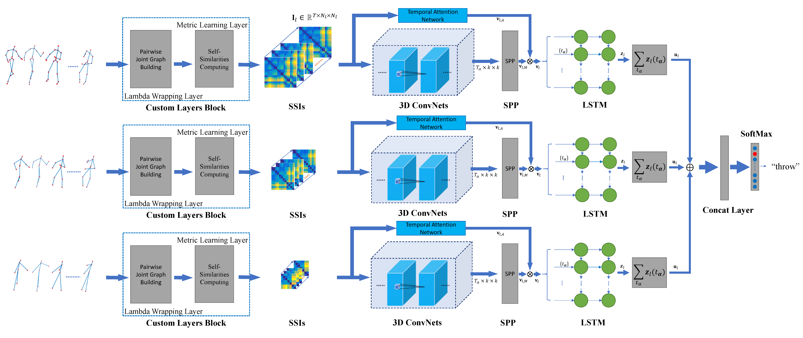

# Learning Representation from Skeletal Self-Similarities for Cross-View Action Recognition
## Introduction
The algorithm is described in the [the paper: Learning Representation from Skeletal Self-Similarities for Cross-View Action Recognition]. In this work, we propose a view-invariant description by formulating self-similarity images (SSIs) of human skeletons, and accordingly introduce a Multi-Stream Neural Network to learn invariant representations from SSIs of varying scales. 

***
