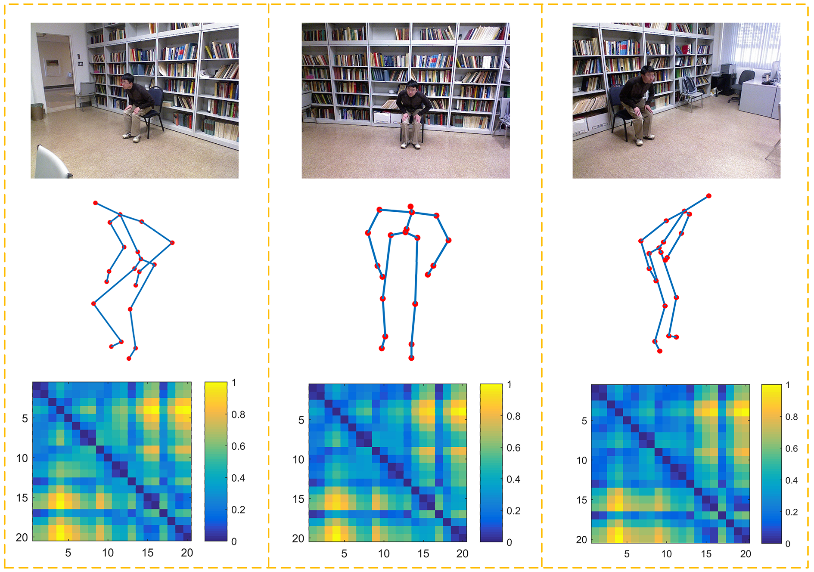
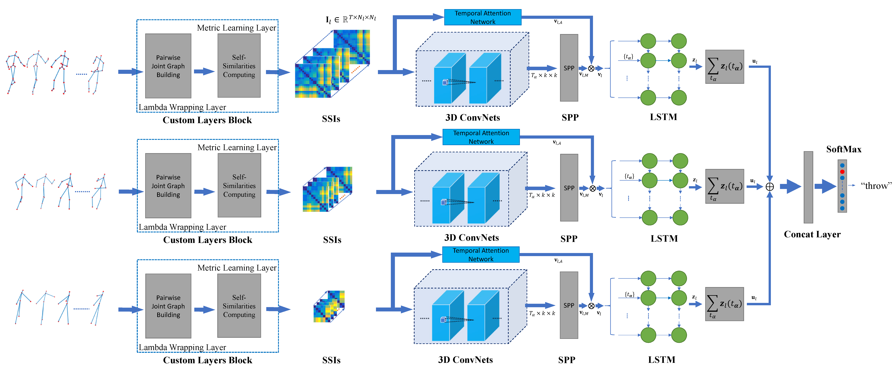

# Learning Representations from Skeletal Self-Similarities for Cross-View Action Recognition
## Introduction
The algorithm is described in the paper: [Learning Representations from Skeletal Self-Similarities for Cross-View Action Recognition](https://ieeexplore.ieee.org/document/8955925). In this work, we propose a view-invariant description by formulating self-similarity images (SSIs) of human skeletons, and accordingly introduce a Multi-Stream Neural Network to learn invariant representations from SSIs of varying scales.

## SSIs and the approach overview
<p align="center">
  
</p>
<p align="center">
  
</p>

## Environment and installation
This repository is developed under **CUDA10.1** and **keras** in **python2.7**. The required python packages can be installed by:
```bash
pip install keras
pip install -r requirements.txt
```
## Data preprocessing

### NTU RGB+D Action Dataset
- Download the skeleton data of the [NTU RGB+D](https://github.com/shahroudy/NTURGB-D) dataset
- Use the Matlab codes provided in `preprocessing/NTU/Matlab` to read the skeleton data and organize the training data with cross-view and cross-subject protocols. The training data are with **.mat** files. Some of the Matlab codes were made by referring to codes in the repository of the [NTU RGB+D](https://github.com/shahroudy/NTURGB-D) dataset.
- Running Matlab codes. `Dataset_Folder` is the path of the downloaded raw skeleton data (**.skeleton** files).
 `Data_Path` is the path of the training and testing data (**.mat** files), which are generated from the raw skeleton data.
  ```matlab
  read_skeletons_mat(Dataset_Folder)
  generate_skeletons_multiscale(Data_Path)
  ```
- Store the training files **.mat** in your own path.
  Run the first function from `preprocessing/NTU/Matlab` so it can find
  `samples_with_missing_skeletons.txt`. It saves the splits in the current
  directory. Set `Data_Path` to that directory, including a trailing separator.

### Northwestern-UCLA Multiview Action Dataset
- Download the Northwestern-UCLA Multiview Action 3D dataset.
- Read the raw skeletons and build the cross-view splits. Edit `filepath` at the top of
  the script to point at your copy of the dataset; the `--view_N` arguments are resolved
  relative to it.
  ```bash
  python preprocessing/UCLA/read_skeletons_ucla_cv.py \
      --view_1 multiview_action/view_1 \
      --view_2 multiview_action/view_2 \
      --view_3 multiview_action/view_3
  ```
- Precompute the SSIs:
  ```bash
  python preprocessing/UCLA/compute_ssm_ucla_cv.py
  ```
- Matlab helpers for plotting skeletons and SSIs are in `preprocessing/UCLA/Matlab`.

### UWA3D-II Multiview Activity Dataset
- Download the UWA3D Multiview Activity II dataset.
- Read the raw skeletons and build the cross-view splits (protocol: views 1,2 vs 3,4):
  ```bash
  python preprocessing/UWA/read_skeletons_uwa_cv.py \
      --view_1 ActionsSkeleton/view_1/ --view_2 ActionsSkeleton/view_2/ \
      --view_3 ActionsSkeleton/view_3/ --view_4 ActionsSkeleton/view_4/
  ```
- Precompute the SSIs:
  ```bash
  python preprocessing/UWA/compute_ssm_uwa_cv.py
  ```

### UESTC RGB-D Varying-view Action Dataset
- Download the [UESTC RGB-D Varying-view 3D Action](https://github.com/HRI-UESTC/CFM-HRI-RGB-D-action-database)
  dataset. Its skeleton files are plain text, named
  `a{action}_d{direction}_p{subject}_c{camera}_skeleton.txt`, covering
  40 actions, 8 horizontal directions, 2 cameras and 40 subjects, with
  25 joints per skeleton.
- Convert the raw text skeletons to **.mat**. Run this from the directory
  holding the `*_skeleton.txt` files; results are written to `SKL_DATA/`:
  ```matlab
  skl_features_extract
  ```
  Check the loop ranges at the top of the script before running: they are
  left at `ACT_NUM = 0:9`, so as shipped it converts only part of the action
  classes. Widen `ACT_NUM` (and `CAMERA_NUM` / `DIRECTION_NUM` /
  `PEOPLE_NUM` if you use a subset) to cover the split you need.
- Build the cross-view splits. There is one script per evaluation protocol;
  each takes the directory of converted **.mat** files and writes the
  `*_Raw_cv*.h5` pairs. Edit `filepath` / `datapath` at the top of the script
  to match your layout.
  ```bash
  python preprocessing/UESTC/read_skeletons_uestc_cv1.py -p mat_from_skeleton/
  python preprocessing/UESTC/read_skeletons_uestc_cv2.py -p mat_from_skeleton/
  python preprocessing/UESTC/read_skeletons_uestc_cs.py  -p mat_from_skeleton/
  python preprocessing/UESTC/read_skeletons_uestc_av.py  -p mat_from_skeleton/
  ```

  | Script | Protocol |
  |--------|----------|
  | `read_skeletons_uestc_cv1.py` | Experimental CV I subset: train d3/c2; test d5/c2. |
  | `read_skeletons_uestc_cv2.py` | Experimental CV II subset: train d1,d3,d5,d7/c2; test d6/c2 only. |
  | `read_skeletons_uestc_cs.py`  | Cross-subject experiment: explicit subject lists; testing restricted to d7/c2. |
  | `read_skeletons_uestc_av.py`  | Arbitrary-view experiment: train d != 8; test on the final tenth of each d8 sequence. |

  Here `d` and `c` are the direction and camera fields in the filenames.
  These scripts preserve historical experiment settings, rather than complete
  implementations of every named benchmark protocol. Inspect the split conditions
  before using them for an evaluation.

  The MATLAB converter saves a variable named `SKL`, whereas the Python readers
  expect a variable named `v` with shape `(frames, 75)`. An explicit conversion
  of the XYZ coordinates and variable name is required between these stages.

- UESTC is captured with Kinect v2.0 and so carries the same 25-joint layout
  as NTU RGB+D; the three SSI scales transfer unchanged.
- `preprocessing/UESTC/Matlab` also holds `drawskt.m` and
  `drawskt_uestc_skeleton.m` for plotting UESTC skeletons and the SSIs built
  from them.

## Running the code
Change the `FILEPATH` constant at the top of each of the following files to your own path
of the prepared training and testing data from **Data preprocessing**.

|              File                  |  Description                                                               |
|------------------------------------|:--------------------------------------------------------------------------:|
| `ntu-latefusion-spp-metric.py`     | MSNN <sub>late</sub> model (late fusion model) for NTU RGB+D dataset.      |
| `ntu-earlyfusion-spp-metric.py`    | MSNN <sub>early</sub> model (early fusion model) for NTU RGB+D dataset.    |
| `ntu-earlyfusion-spp-metric-c3d.py`| MSNN <sub>early</sub>-C3D model (early fusion model) for NTU RGB+D dataset.|

Notes: In MSNN <sub>early</sub>-C3D model, we use the existing pretrained C3D networks as 3D CNN branches instead of our own designed light-weight CNNs.
This model additionally requires the Sports-1M pretrained weights `sports1M_weights_tf.h5`
(from [axon-research/c3d-keras](https://github.com/axon-research/c3d-keras), see its
`models/get_weights_and_mean.sh`) to be present in the working directory.

Other knobs at the top of each script: `GPUS` (passed to `keras.utils.multi_gpu_model`),
`MAX_LEN`, `CLASS_NUM`, `BATCH_SIZE` and `LAMBDA1` (the &lambda;<sub>1</sub> of Eq. (8),
set to 1e-6 as in Sec. IV-B).

### Shared modules

|              File     |  Description                                                                  |
|-----------------------|:------------------------------------------------------------------------------|
| `MetricLayer.py`      | Learnable Mahalanobis metric layer (Eq. 1-3). `MetricLayer_ForC3D` replicates the SSI into 3 channels for the pretrained C3D branch. |
| `ssi_layers.py`       | Lambda helpers that build the pairwise joint graph and reshape SSIs.          |
| `data_utils.py`       | Loading the `.mat` splits, sequence padding, and the `*_Raw_cv*.h5` cache.    |
| `viz_utils.py`        | `LrReducer` callback, confusion-matrix / training-curve / feature-map plots.  |

### Known differences between the NTU and the other datasets

The NTU scripts integrate the SSI computation into the network as a learnable
`MetricLayer`, which is the approach described in the paper. The UCLA and UWA folders
also contain historical `compute_ssm_*_cv.py` scripts for **precomputed** SSIs.
The `read_skeletons_*.py` scripts write raw skeleton coordinates; they do not compute
SSIs, and there is no UESTC SSI-generation script in this repository.

The UCLA/UWA raw readers write `(samples, frames, joints, 3)` arrays, while the
historical SSI generators expect flattened XYZ coordinates. Their data layouts
must be reconciled before running the two stages together. The precomputed and
learnable-SSI pipelines are not interchangeable.

***
## Citation
If you find this code useful, please cite our work with the following bibtex:
```
@ARTICLE{shao2020ssi,
author={Z. {Shao} and Y. {Li} and H. {Zhang}},
journal={IEEE Transactions on Circuits and Systems for Video Technology},
title={Learning Representations from Skeletal Self-Similarities for Cross-view Action Recognition},
year={2020},
volume={},
number={},
pages={1-1},
keywords={Cross-view action recognition;Human skeleton;Self-similarity;Multi-stream neural network;View-invariant representation},
doi={10.1109/TCSVT.2020.2965574},
ISSN={1558-2205},
month={},}
```
